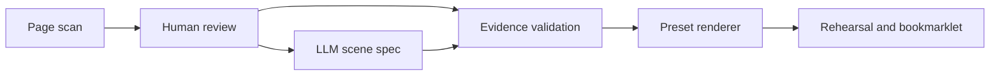

# Demo Kit Generator

**Turn a website scan and a model-written scene spec into a rehearsal-ready browser demo.**

A portfolio project about making customer demos repeatable: collect page evidence, ask an LLM to propose scenes, validate the output, and render it using a reusable JavaScript shell. No application backend or model API key is required.

The public edition contains a fictional outdoor store, Northstar. It does not include employer knowledge bases, customer briefs, real-brand demo kits, or private model configuration.

## Try it in two minutes

Requires Python 3.10+ to build and serve locally. The browser tools themselves have no package dependencies.

```sh
python3 build.py
python3 -m http.server 8080 --bind 127.0.0.1
```

Open [the fictional storefront](http://127.0.0.1:8080/dist/PLAYGROUND.html), click **Launch the 3-scene demo**, and switch between return visit, on-page change and owner guidance. **Reset** restores recorded edits; **Exit** removes the demo.

Open [the example kit](http://127.0.0.1:8080/dist/NORTHSTAR_DEMO_KIT.html) to inspect its scene order, talk track and implementation notes. No AI account is needed for this example.

## Why this exists

A convincing demo often needs to look like the customer's site, yet writing one-off scripts makes preparation slow and fragile. Asking an LLM for arbitrary JavaScript moves that fragility elsewhere.

This project separates the work:



- **Evidence over self-assertion:** product fields, URLs and selectors are compared with the original scan, not the model's own claimed sources.
- **Data instead of generated programs:** the model writes JSON consumed by a fixed renderer.
- **Field-ready output:** the kit carries scene order, talk lines, preparation notes and diagnostics.
- **Small distribution:** standalone HTML tools, with Python's standard library for builds.

No time savings, conversion uplift or team adoption numbers are claimed; those have not been measured for this public edition.

## Make a new demo

1. Open `dist/SITE_SCAN_KIT.html` and install the scan bookmarklet in Chrome.
2. Scan public pages you are authorized to use. Review the copied JSON for identifiers and sensitive URLs.
3. Open `dist/KIT_BUILDER.html`, paste the scan in step 1 and edit the brief.
4. Give your chosen model `prompts/SCENE_DESIGNER.md`, `spec_schema.json`, the example spec and your reviewed scan. The optional Gemini link is a convenience, not a dependency.
5. Paste its JSON into step 2. Fix validation errors before saving the kit.
6. Rehearse on the intended page before presenting. A successful local test does not prove compatibility with another site's CSP or framework.

The bundled `examples/northstar.scan.json` is deliberately **synthetic evidence for the local fixture**, not a captured customer scan. Its URLs assume localhost port 8080; changing the port requires updating the example scan and spec together and rebuilding.

## What is included

| Location | Purpose |
|---|---|
| `shell/shell.js` | Shared renderer and cleanup; 15 inherited presentation patterns |
| `scan/scan.js` | DOM and metadata scanner |
| `builder_template.html` | Evidence validation, brief and kit builder; English default |
| `scan_template.html` | Scanner installation page |
| `spec_schema.json` | Scene format reference; runtime uses explicit checks, not a full JSON Schema engine |
| `examples/` | Fictional store, source spec and synthetic evidence |
| `prompts/SCENE_DESIGNER.md` | Model-independent scene design instructions |
| `tests/` | Browser checks for evidence rejection and DOM restoration |
| `docs/ARCHITECTURE.md` | Design choices, data handling and limitations |
| `docs/PUBLICATION.md` | Provenance and remaining publication decisions |
| `dist/` | Reproducible tools and runnable example |

Edit sources, then run `python3 build.py`. Do not edit generated HTML. This edition uses English templates directly; it does not carry the internal localization generation pipeline or vendor-specific knowledge files.

## Checks

The static checks additionally require Node.js on PATH. Run `python3 tests/check_release.py` for syntax/data and public-file checks. With the local server running, open [browser checks](http://127.0.0.1:8080/tests/index.html) and click **Run checks**. They exercise the local builder and fictional storefront, without calling an LLM or customer site.

The browser suite is deliberately focused. It does not certify all 15 patterns, every site framework, mobile behavior or every CSP configuration.

## Data and execution boundaries

- The scanner reads loaded page text, metadata, links, selectors and product information. It stores accumulated scans in the page origin's `sessionStorage`. Closing the panel does not clear the scan.
- The builder also remembers the scan in `sessionStorage`; saved kits embed the scan and spec. Treat exported kits as containing the source information you supplied.
- Pasting a scan into an external AI service sends it to that provider under your account's settings. The tool itself has no model API integration.
- The renderer has no order/lead submission backend. Product images may load over the network; links can navigate; the underlying site may continue analytics and other requests.
- Scans are evidence for consistency, not authenticated truth. Review misleading page content and model output yourself. Do not scan logged-in accounts, checkout details, private portals or sensitive pages for a public demo.
- Reset preserves recorded node identities and text, but cannot rewind application state or concurrent site changes. Reload the page if its own framework behaves unexpectedly.
- Rich HTML is restricted to formatting tags. This is not a sandbox for untrusted programs. Only use reviewed specs; no general security certification is claimed.

## Project status and licensing

Prepared as a public portfolio candidate. No open-source license has been selected, and no employer ownership or publication approval is implied. See `docs/PUBLICATION.md` before making the repository public. No trademark owner endorses this project.
